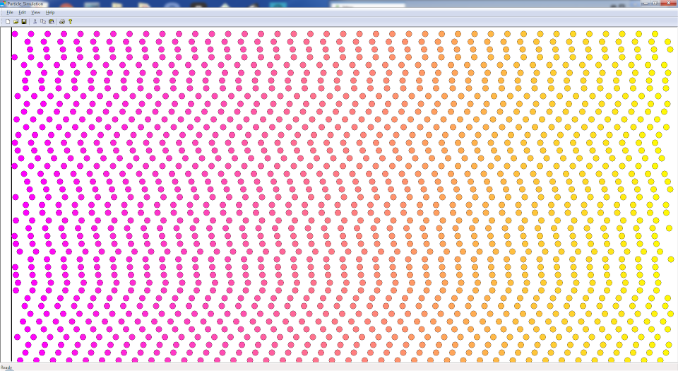
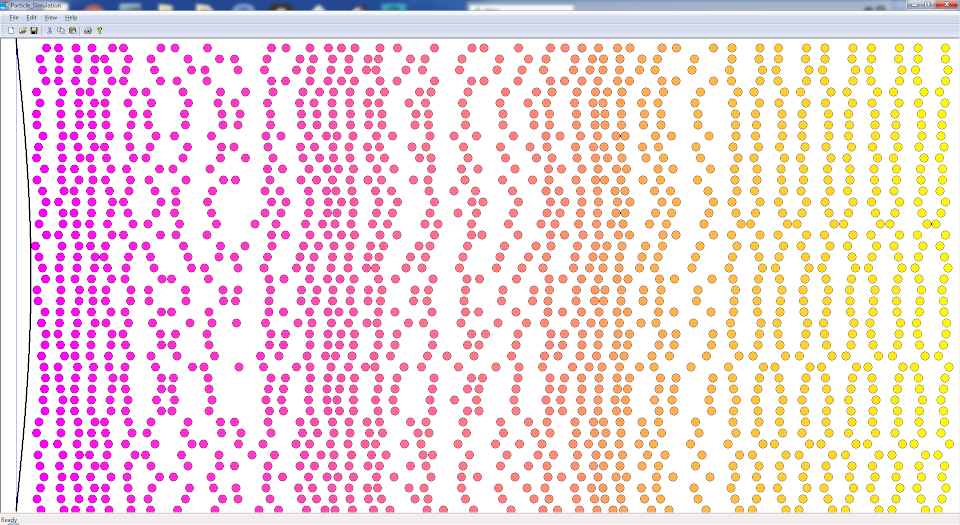
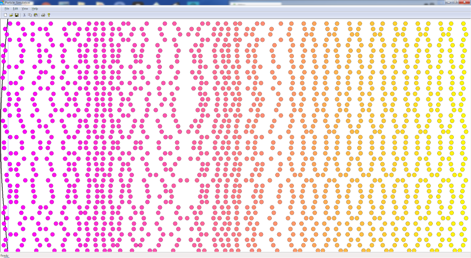

# Sound Wave - Air Particle Simulation
A simplified simulation of sound wave propagation by the collision of air particles. This simulation is designed to help secondary students understand the concept of sound wave propagation.
A Windows Graphical User Interface to visualize the sound wave propagation. This is a C++ application and MS Visual Studio 2015 (v14), Standard template library, and Windows template library (v10.9163) are used.

### The initial arrangement of the particles
Air particles are evenly arranged initially. The particles are color coded from magenta (left) to yellow (right). For simplicity, I assumed air particles move along the X-direction and collide against each other. The vertical line on the left shows the position of a membrane. The membrane oscillates left and right and air particles are compressed and expanded by the position of the membrane. 

### Compression of air particles by the membrane
The membrane is on the right side compressing the air colliding on the membrane. As the stationary color arragement indicates, particles do not singificantly travel along the X-axis. You can observe compression and rarefaction of the air particles by the membrane.

### Rarefaction of air particles by the membrane
The membrane is on the left side expanding the air colliding on the membrane.

